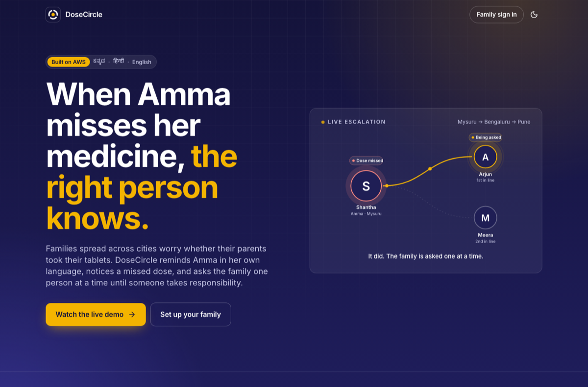
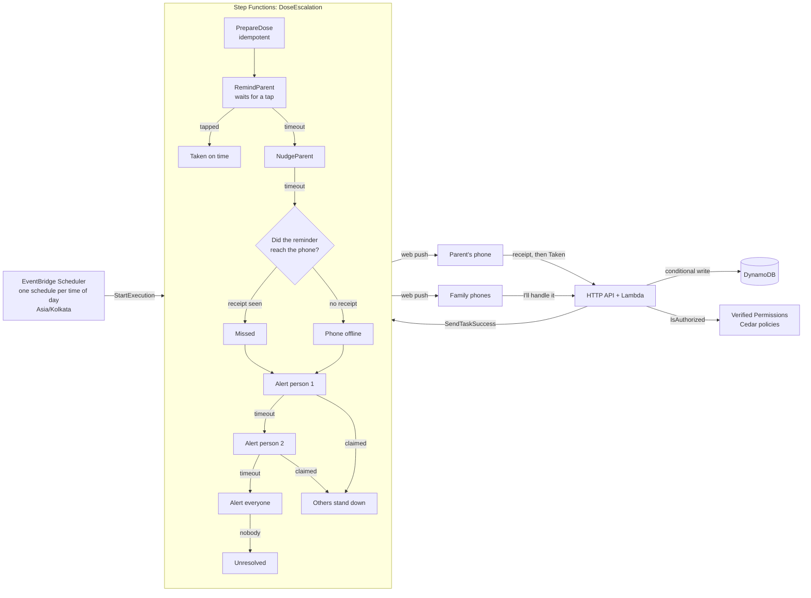
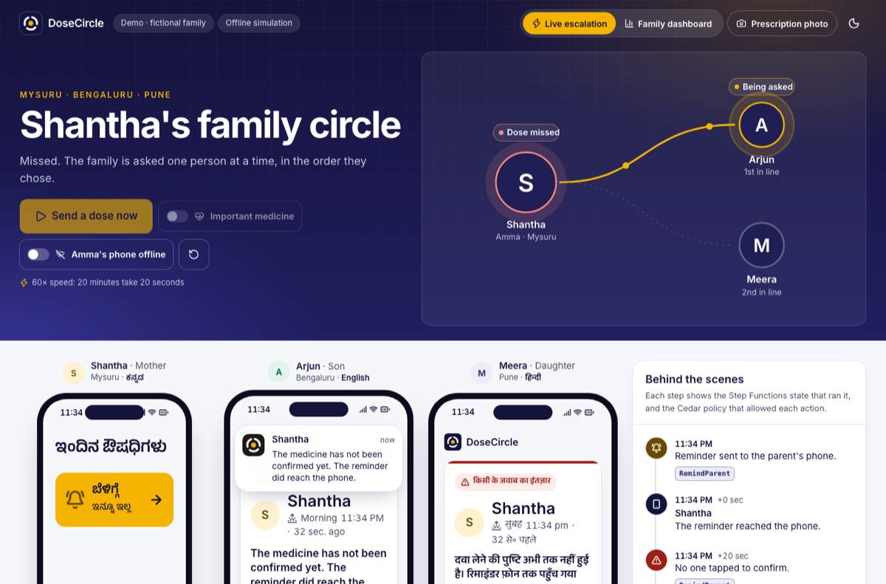
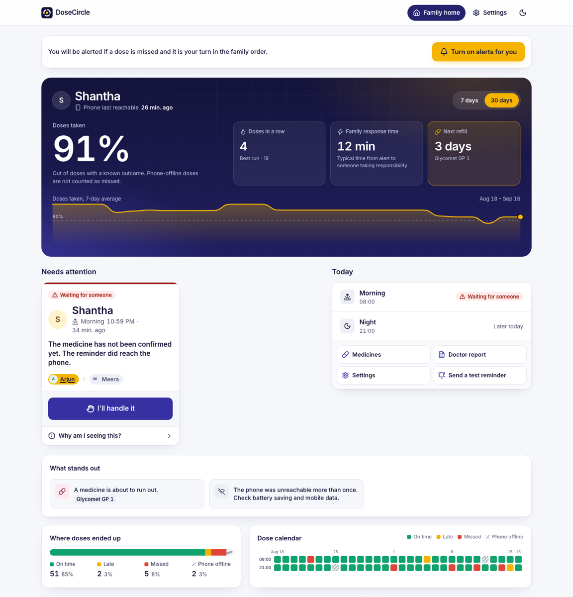
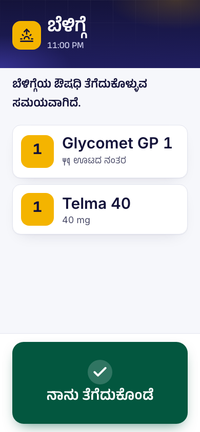

# DoseCircle

**When a parent misses their medicine, the right person in the family knows.**

An elderly parent lives in another city and takes daily medicines. If a dose isn't confirmed, DoseCircle
works out whether the reminder even reached their phone, then alerts the family **one person at a time**
in an order the family chose. The first to tap **"I'll handle it"** claims the dose, and everyone else is
told to stand down.

Built for WeMakeDevs × AWS **First Commit** (Bharat Builds Tour), 17–20 September 2026.

- **Live URL:** _added after deployment_
- **Judge demo:** `/demo` — a fictional family, three phones side by side, each in its owner's language,
  running the real AWS workflow at 60× speed.

> Reminders and family alerts only. DoseCircle does not give medical advice.



## Who it is for

- **Amma, 68, in Mysuru.** Reads Kannada. Gets one calm screen: the time of day, her tablets with the
  names exactly as printed on the strip, and one large green button. No password, ever.
- **Her son in Bengaluru and daughter in Pune.** Read English and Hindi. They are only disturbed when
  something actually needs them, and never twice for the same dose.

## What it does

| Feature | State |
|---|---|
| A reminder per time of day, in the parent's own language, with a 10-second on-device undo | Built |
| Missed vs "phone seems offline", told apart from a delivery receipt the phone sends back | Built |
| Family escalation ladder: person 1, then person 2, then everyone; claim and stand-down | Built |
| Faster ladder for a critical medicine or a repeat miss | Built |
| "Why am I seeing this?" timeline, built from the workflow's own history | Built |
| Family analytics: adherence against the 80% benchmark, dose calendar, timing drift, who responds, refill run-out | Built |
| Prescription photo → Textract → Claude on Bedrock → a person confirms every line before anything is saved | Built |
| Refill warning when tablets are running low | Built |
| Printable doctor report (an app record, not a medical record) | Built |
| Judge demo mode: fictional family, 60× speed, reset | Built |
| Voice clips for the reminder screen | Waiting on native recordings |
| Kannada and Hindi text | Drafted; hidden until a native speaker signs off |

## How a missed dose travels



- **Waiting is free.** A Standard workflow is billed per step, not per minute, so a 20-minute wait for
  Amma to tap costs nothing.
- **Races converge.** Every status change is a conditional write, and a workflow step that finds the dose
  already resolved completes itself. Two people tapping "I'll handle it" at the same moment yields one
  winner and a clear "someone else got there first" for the other.
- **Every action is authorised.** 13 Cedar policies in Amazon Verified Permissions decide who may see a
  parent or claim a dose, and the policy that allowed each action is recorded and shown in the timeline.



## Where AWS fits

| Service | Why this one |
|---|---|
| **EventBridge Scheduler** | One cron schedule per parent per time of day, in `Asia/Kolkata`, starting Step Functions directly with no Lambda in between. A dead-letter queue catches anything that fails to start. |
| **Step Functions** (Standard) | One execution per dose. `waitForTaskToken` lets a workflow wait for a human, and the wait itself is free. |
| **Lambda** (Node.js 24, arm64) | API handlers, the three workflow steps, the authorizer, and the prescription reader. |
| **API Gateway** (HTTP API) | Cognito JWT for family members, a Lambda authorizer for parent phones and demo sessions, and per-route throttles. |
| **DynamoDB** | One table. Conditional writes make claims, confirmations and receipts race-safe; TTL clears demo data and old doses. |
| **Amazon Verified Permissions** | Cedar policies, tested offline and enforced on every request. |
| **Cognito** | Family sign-in. Parents never get an account. |
| **Amazon Textract** | Reads the lines of a prescription photo, in Mumbai. |
| **Claude Sonnet 4.6 on Bedrock** | Transcribes each medicine exactly as written. The schedule codes (1-0-1, OD, BD, HS, SOS) are decoded by a fixed table in code, never by the model. |
| **Bedrock Guardrails** | Classic tier, which stays in Mumbai, removes anything resembling medical advice from the model's notes. |
| **S3** | Prescription photos, private, deleted after 7 days. |
| **Polly** | Voice clips for Hindi and Indian English. AWS has no Kannada voice, so Kannada uses native recordings. |
| **CloudWatch + Budgets** | A dose-funnel dashboard, 7 alarms, and a monthly budget. |
| **Amplify Hosting** | The web app, with a strict content-security policy and `sw.js` never cached. |

Everything runs in **ap-south-1 (Mumbai)**. The one exception is Claude: from Mumbai it is only reachable
through the global cross-Region profile, so a prescription photo may be processed outside India. The app
says so before the upload, and the demo only uses a fictional prescription.

**Cost: about ₹2.5 (US$0.03) per parent per month**, and roughly US$0.03 per prescription read. See
[docs/cost.md](docs/cost.md).

## Languages, done carefully

Each person picks their own language, and Kannada is first-class.

- **Whole sentences only.** No name, number or medicine name is ever inserted into a translated sentence,
  because Kannada and other Indian languages inflect nouns. Names live in notification titles and their own
  UI elements; numbers and dates go through `Intl`.
- **Medicine names are never translated**, and always appear in Latin script exactly as printed on the strip.
- **Nothing ships unreviewed.** Each string records who reviewed it. A language appears in the picker only
  when every string is signed off, and a missing string falls back to **English, never another Indian
  language**. `pnpm i18n:check` enforces this, and reviewers work from a spreadsheet
  (`pnpm i18n:export kn`). See [docs/languages.md](docs/languages.md).



## Analytics the family can act on

The dashboard is built from the app's own dose records: adherence with the change from the previous period
and the 80% clinical benchmark, current and best streak, the family's typical response time, a 30-day dose
calendar, how many minutes after each reminder the dose was taken, misses by weekday and time of day,
adherence per medicine, who resolved each escalation and how fast, and when each medicine runs out.

The choices behind it (light theme, one meaning per colour, the 80% line, showing timing and not just
taken-or-not) come from published guidance and research, cited in [docs/design.md](docs/design.md).

<p align="center"></p>

## Repository

| Path | What |
|---|---|
| `shared/` | Domain logic used by backend and web: dose statuses, ladder timings, prescription shorthand, refill maths |
| `shared/i18n/` | Notification strings, with a reviewer recorded per string |
| `backend/` | Lambda handlers, workflow steps, authorizer, analytics, scripts |
| `infra/` | AWS CDK app, the state machine definition, and its tests |
| `web/` | React PWA: parent screens, family app, judge demo, service worker |
| `cedar/` | Cedar schema and the 13 authorization policies |
| `docs/` | Architecture, cost, security, languages, design, demo script, learning log |
| `scripts/` | Deployment, translation review tooling, voice clip helpers |

## Develop

Needs Node.js 24+ and pnpm. **No AWS account is needed to run it locally:** the demo runs an in-browser
simulation of the workflow, and the family and parent screens use a small local backend.

```bash
pnpm install
pnpm --filter @dosecircle/web dev     # http://localhost:5173
```

Then open `/` , `/demo`, `/home` and `/parent`.

```bash
pnpm test         # 144 tests: domain rules, workflow shape, Cedar policies, analytics, i18n gate
pnpm typecheck
pnpm synth        # build the CloudFormation template offline (bundles every Lambda)
pnpm i18n:check   # translation coverage and safety rules
```

## Deploy

```bash
AWS_PROFILE=<profile> ALARM_EMAIL=you@example.com scripts/deploy.sh
```

The script is safe to re-run. It creates the Amplify app (so the API knows which origin to allow),
bootstraps CDK, creates the secrets in SSM without ever overwriting them, deploys the stack to Mumbai, then
builds and uploads the web app. See [docs/deploy.md](docs/deploy.md).

## AI tools used

**Claude Code** (Anthropic) was used throughout: planning, writing the code and tests, the design system,
the Kannada and Hindi draft translations, and these docs. Every draft translation is marked unreviewed until
a native speaker signs it off. Listed here as the hackathon rules require.

## Credits and licences

- Code: MIT, see [LICENSE](LICENSE).
- [Inter](https://rsms.me/inter/) and the [Anek](https://fonts.google.com/?query=Anek) family (Kannada and
  Devanagari), both SIL Open Font License 1.1, self-hosted through Fontsource.
- [lucide](https://lucide.dev) icons, ISC.
- Kannada and Hindi reviewers and the voice speaker will be credited here by name, with their permission.
- The sample prescription, the demo family and every name in it are fictional.
